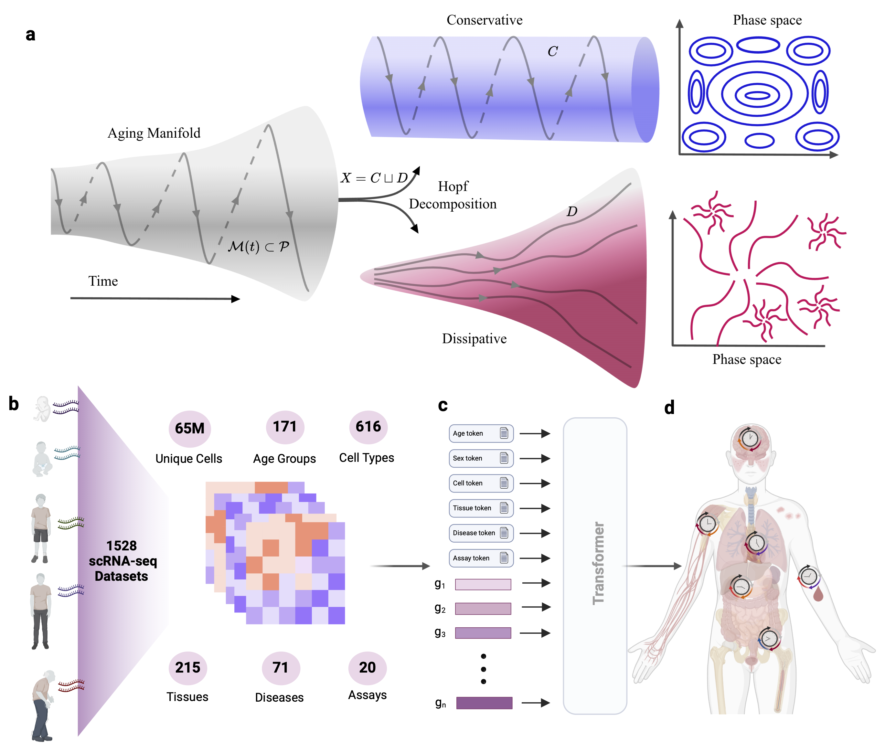

# The Dissipation Theory of Aging: A Quantitative Analysis Using a Cellular Aging Map

[](https://arxiv.org/abs/2504.13044v1)

> We propose a new theory for aging based on dynamical systems and provide a data-driven computational method to quantify the changes at the cellular level. To quantify the dissipation dynamics, we employ a transformer-based machine learning algorithm to analyze gene expression data, incorporating age as a token to assess how age-related dissipation is reflected in the embedding space. By evaluating the dynamics of gene and age embeddings, we provide a cellular aging map (CAM) and identify patterns indicative of divergence in gene embedding space, nonlinear transitions, and entropy variations during aging for various tissues and cell types.

  

This repository contains the model training code, embedding extraction, Hopf decomposition and entropy calculation from the paper. As well as notebooks to generate figures.

## Installation
Install gcc and g++:

```bash
sudo apt-get install gcc g++
```

Install the requirements:
```bash
pip install -r requirements.txt
```

## Train a Polygene Model

After downloading CellxGene's dataset or a subset from Tabula Sapiens dataset you can train a phenotype-genotype model with
```bash
./run_training.sh
```

## Repository Structure

```
.
├── data_utils # Scripts for training a model - tokenizer and dataloader
│   ├── vocab
│   ├── __init__.py
│   └── tokenization.py
│   ├── ann_datasets.py
│   ├── data_collators.py
│   ├── sharded_trainer.py
├── eval # Inference Analysis
│   ├── __init__.py
│   └── metrics.py
│   ├── extract_entropy.py # Inference of tissue and cell type and extraction entropy of prediction for both phenotypes
│   ├── gene_trajectories.py # Computation of gene trajectories with cosine similarity matrix, Hopf Decomposition Metrics
│   ├── extract_embeddings.py # Extract Cell type, tissue, age label embeddings and age prediction gap.
├── model 
│   ├── __init__.py
│   ├── model.py # Model Architecture
├── notebooks
│   ├── figures # Analysis & Paper Figures
│   └── inference.ipynb # Example model use
├── __init__.py
├── main.py 
├── configs.py
├── requirements.txt
├── README.md
└── run_training.sh
```

## Citation

If you use this work, please cite:

> **Khodaee et al. (2025).** The Dissipation Theory of Aging: A Quantitative Analysis Using a Cellular Aging Map. *arXiv preprint arXiv:2504.13044v1*.  
> https://arxiv.org/abs/2504.13044v1

Or in BibTeX format:

```bibtex
@misc{khodaee2025dissipationtheoryagingquantitative,
      title={The Dissipation Theory of Aging: A Quantitative Analysis Using a Cellular Aging Map}, 
      author={Farhan Khodaee and Rohola Zandie and Yufan Xia and Elazer R. Edelman},
      year={2025},
      eprint={2504.13044},
      archivePrefix={arXiv},
      primaryClass={q-bio.QM},
      url={https://arxiv.org/abs/2504.13044}, 
}
```
